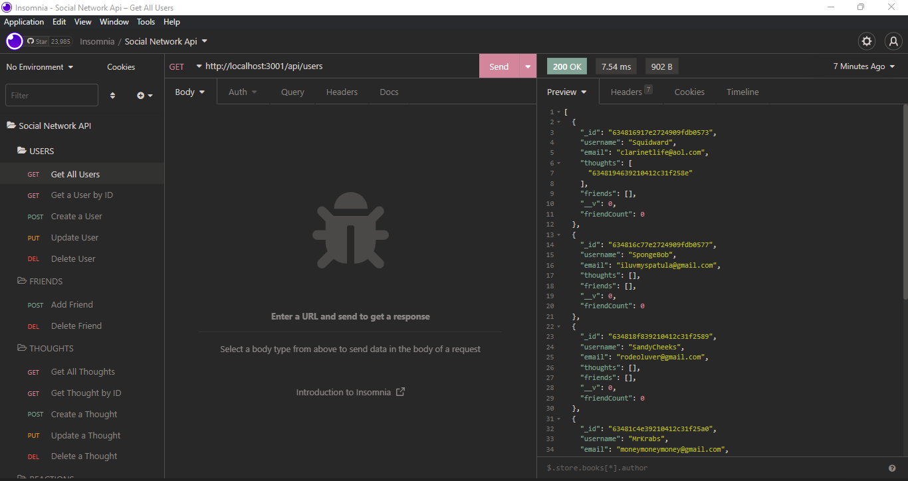

# NoSQL Challenge: Social Network API

Module 18: MongoDB

## Table of Contents
1. [Description](#description)
2. [Usage](#usage)
3. [Visuals](#visuals)

## Description
In this application, I built an API for a social network application where users can share their thoughts, react to friends, and create a friend's list. I will use Express.js for routing, a MongoDB database, the Mongoose ODM, and Insomnia Core for demonstration.

[GitHub Repo](https://github.com/alyssa20lopez/social-network-api)

## Usage
To use this application, first clone the project and navigate to VS Code. In the command-line, install the following packages:
- npm i mongoose
- npm i express

To start the application, type 'nodemon server.js' in the command-line.

## Visuals
Here is a visual of the walkthrough video.

<!-- Link to Walkthrough Video -->
[Click this link to access the walkthrough video](https://drive.google.com/file/d/1_MAWpbK0NmMgAsAJHsb594Kkh_YssvYi/view) 
